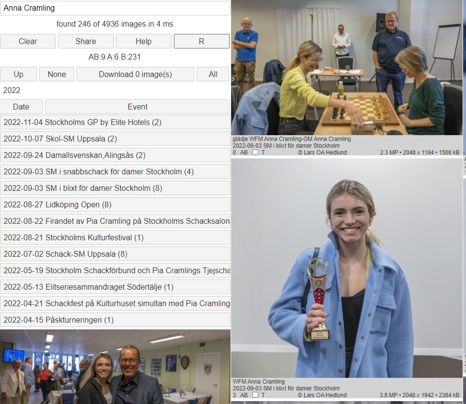

# Bildbanken 2

### Introduktion

Detta program används för att hitta bland fotografier från tio års fotograferande inom den svenska schackvärlden av Lars OA Hedlund.  
När du startar ser du alla bilder, med de senaste högst upp.  
Du kan avgränsa sökandet på två sätt:

1. Genom att välja katalog. Hierarkin ser ut ungefär så här:
	1. Home
	2. År
	3. Turnering/Event
	4. Klass
	5. Grupp

2. Genom att skriva in ett eller flera ord i sökrutan längst upp.
	Skriv du flera ord, kommer bilderna högre upp ju fler träffar orden får.
	(Man kan säga att OCH kommer före ELLER)

	* [Clear] rensar sökrutan
	* [Share] kopierar aktuell URL till klippbordet
	* [Help] visar denna sida
	* [R] rensar bort redundans
	* [Up] går till närmast högre liggande katalog
	* [None] avmarkerar alla bilder
	* [Download] hämtar alla markerade bilder i en zipfil
	* [All] markerar alla bilder
	* Home = aktuell katalog. Här ser du alla bilder
	* [Date] sorterar på datum, fallande
	* [Event] sorterar på event, stigande
	* [2022 (4936)] visar de 4936 bilder som tagits detta år.
	* Klicka på en bild om du vill se högre upplösning. 
		* En ny flik skapas där du kan zooma (med mushjulet) och panorera
		* Bakom bilden finns tekniska data. Bland annat bländare, exponeringstid, objektiv, fotograf, tidpunkt

### Sökning

Sökning genomförs genom att fylla i sökrutan.  
Dessa ord, avgränsade av blanktecken, matchas mot texterna i kataloger och filnamn  
De kombineras automatiskt med OCH och ELLER  
Underscore (_) kan användas för att binda ihop ord, t ex Numa_Karlsson  

Sökningen kräver att man anger rätt VERSALER och gemener, t ex ger varken "KARLSSON" eller "karlsson" någon träff, däremot "Karlsson"  
De ord man anger kan vara delord, även enstaka tecken, och de kan stå var som helst i orden. T ex kommer "sson" att matcha ett antal Karlsson och Nilsson  

Tom söksträng innebär att alla bilder matchar.

Sökning går endast mot den katalog man valt. Välj Home om du vill söka i alla kataloger.

### Exempel

Vi ser att 834 bilder har med Anna eller Cramling att göra. Vill du bara se Anna_Cramling, använd underscore. Sökningen tog 31 millisekunder.

AB:116 innebär att båda orden förekom i 116 bilder. A:48 innebär att enbart Anna förekom i ytterligare 48 bilder. B:670 innebär att enbart Cramling förekom i 670 bilder (troligen Pia eller Dan Cramling).

246 av de 834 bilderna är tagna år 2022.

Varje bild är märkt med AB, A, B eller motsvarande.

Kryssrutan används vid Download.

T kan man klicka på. Då får man se turneringsresultatet.

2.3 MP = 2.3 miljoner pixlar.

2048 x 1194 = bredd och höjd.

1508 kb = bildens storlek i kilobytes.

