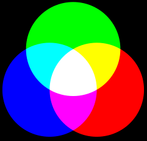

# Ny hantering av Bildbanken

### Intro

För att snabba upp sökningar, skapas en fil, *bilder.js*, som innehåller katalognamn och filnamn.
Denna fil, som egentligen är en [JSON](https://en.wikipedia.org/wiki/JSON)-fil, hämtas ner till klienten.

Att krympa bilder är en långsam process, därför cachas lokala bilder.js i varje katalog *small*. 
Denna katalog innehåller även *thumbnails*, [wikipedia](https://en.wikipedia.org/wiki/Thumbnail).

Pythonprogrammet bilder.py underhåller denna fil.

### Format

* Alla blanktecken byts mot _ (underscore)
* Första speldatum anges först i turneringens namn (yyyy-mm-dd).
* Turneringens nummer enligt member.schack.se, T10368, anges sist i katalognamnet för bilderna.
	* Klass_AB_[T10368](https://member.schack.se/ShowTournamentServlet?id=10368) Kristallens JGP/Klass AB
* Förslagsvis kan medlemsnummer (member.schack.se) användas i framtiden för att spara plats och tid.
	* Dessa skulle även ge snabb access till personlig information, typ rating och andra turneringar.
	* Exempel: M430365 och M585772 i spänd väntan på startsignalen.jpg
		* [M430365](https://member.schack.se/ViewPlayerRatingDiagram?memberid=430365) Edvin Trost
		* [M585772](https://member.schack.se/ViewPlayerRatingDiagram?memberid=585772) Numa Karlsson

```
database
	bilder.js
	2022
		2022-09-17_Kristallens_JGP
			Klass_AB_T10368
				1.FM_Edvin_Trost_Klass_A_2022-09-17-X.jpg
				small
					bilder.js
					1.FM_Edvin_Trost_Klass_A_2022-09-17-X.jpg
			Klass_D_T10370
				7.Numa_Karlsson_klass_D_2022-09-17.jpg
				small
					bilder.js
					7.Numa_Karlsson_klass_D_2022-09-17.jpg
	2021
	2020
```
Filer har *extension* [.jpg](https://en.wikipedia.org/wiki/JPEG) och .js, övriga är kataloger.

* Filen *bilder.js* avspeglar katalogstrukturen.
* Den är uppbyggd mha *{}*, även kallad [object](https://www.w3schools.com/js/js_objects.asp) i Javascript och [dict](https://python.fandom.com/wiki/Dictionaries) i Python.
	* En bild nås via database["2022"]["2022-09-17_Kristallens_JGP"]["Klass_D_T10370"]["7.Numa_Karlsson_klass_D_2022-09-17.jpg"] == [432,300]
	* Texterna i klamrarna, även kallade *nycklar* eller *keys* utgör underlaget för all sökning.
* bilder.js innehåller även *width* och *height* för varje thumbnail. Höjden används för utplacering i rätt [swimlane](https://en.wikipedia.org/wiki/Swimlane), bredderna är samma för alla thumbnails.

### Ungefärliga filstorlekar

* Högupplöst bild: 2 Mbyte (t ex 2048x1365)
* Thumbnail: 25 kbyte (t ex 432x300) (1% av högupplöst bild)
* Databas per bild: 75 byte (filnamn + överordnade katalognamn) (35 ppm av högupplöst bild)
* Databas för 50k bilder: 4 Mbyte

### Sökning

Sökning genomförs genom att fylla i sökrutan. Dessa ord, avgränsade av blanktecken, matchas mot texterna i kataloger och filnamn. De kombineras automatiskt med OCH och ELLER. Underscore, _, kan användas för att binda ihop ord, t ex Numa_Karlsson, för att slippa en mängd falska Karlsson. (Falska Numor lär det vara mindre risk för).

Sökning görs enbart i de kataloger som framgår av strukturen. Vill man söka på allt, klickar man först på Home. Vill man avgränsa sig till 2022, klickar man först på den katalogen. Vill man enbart söka på "Schack-SM", oavsett år, skriver man "Schack-SM" i sökrutan.
Sökningen kräver att man anger rätt VERSALER och gemener, t ex ger varken "KARLSSON" eller "karlsson" någon träff, däremot "Karlsson".
De ord man anger man anger vara delord, även enstaka tecken, och de kan stå var som helst i orden. T ex kommer "sson" att matcha ett antal Karlsson och Nilsson.

### Knappar

#### Horisontala Navigeringsknappar
Dessa utgörs av Home, 2022 osv. Man hoppar till en katalog närmare *roten* (Home).

#### Vertikala Katalogknappar och Filknappar
Dessa utgörs av 2022, 2021 osv. Man hoppar till en katalog närmare *löven* (bilderna)

#### Prev (Not implemented)
I storbildsläget visas föregående bild.

#### Next (Not implemented)
I storbildsläget visas nästa bild.

#### Play/Pause (Not implemented)
Markerade bilder visas i ett evigt bildspel.

#### Result (Not implemented)
För de turneringar där man angett Turneringsnummer, kan man klicka på denna knapp och se resultatsidan direkt.

#### Download (Not implemented)
De bilder man markerat laddas ner till klientens Download-katalog.

#### Share (Not implemented)
Aktuell avgränsning, dvs både strukturellt och med sökord, kan hämtas på klippbordet som en [URL](https://en.wikipedia.org/wiki/URL).

#### All (Not implemented)
Alla bilder markeras.

#### None (Not implemented)
Alla markeringar tas bort.

### Vad innebär ABC?

* Sökningen visar bilderna med flest träffar först
* I andra hand prioriteras ord tidigt i söksträngen högre än senare ord
* T ex visar sökningen "A B" bilder i denna ordning
	* AB = Båda orden är med
	* A  = Endast första ordet, A, är med
	* B  = Endast sista ordet, B, är med
* AB:2 A:1 B:3 innebär att endast två bilder innehåller båda orden.
* Totalt har 6 bilder hittats, varav fyra med enbart A eller B.

Sökningen "A B C" visar träffarna i denna ordning:
```
ABC = Vitt
AB  = Gult
AC  = Magenta
BC  = Cyan
A   = Rött
B   = Grönt
C   = Blått
Ingen träff = Svart
```


### bilder.py

Så här uppdaterar man databasen med nya bildsamlingar.

* Skapa de kataloger som behövs. Namnge korrekt. Inga mellanslag.
	* public
		* Home
			* 2022
				* 2022-09-17_Kristallens_JGP
					* Klass_AB_T12345
						* 7.Numa_Karlsson_klass_D_2022-09-17.jpg

Starta Pythonprogrammet bilder.py. Följande kommer att ske:
* small-katalogerna skapas. Dessa ligger i samma katalog som de stora .jpg-filerna.
* Thumbnails skapas och läggs i small-katalogen.
* Cache av bilder.js (med bredd och höjd för varje bild) läggs i small.
* Alla bilder.js sammanställs till den totala public/Home/bilder.js
* Cacharna finns pga att det tar cirka 100 ms att skapa en thumbnail.
* Att skapa om alla cachar tar drygt en timme.
	* Detta kan framtvingas genom att sätta USE_CACHE = False i bilder.py
