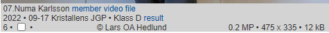

### Scrollhantering

Jag skulle vilja att bara en flik används för många bilder och en bild. Fick dock problem med att man tappar scrollpositionen efter att ha återvänt från BigPicture. Min workaround blev att visa BigPicture i eget fönster. Positiv sidoeffekt är att man kan ha flera bilder öppna i var sitt fönster.

Det som komplicerar är att infinite scroll används för framsökta bilder.

### Info-knappen

Då man klickar eller scrollar läses information in om den stora bilden (*EXIF-data*)

Filen **src\json\bilder.json** återspeglar katalogstrukturen för katalogerna **Home** och **small**
```json
{
	"2022": {
		"2022-09-17_Kristallens_JGP": {
		"Klass_AB_T10368": {
				"1.FM_Edvin_Trost_Klass_A_2022-09-17-X.jpg":[475,267,224639,1600,1200],
				...
			}
		}
	}
}

pixlar,pixlar,bytes, pixlar,pixlar
[475,  267,   224639,1600,  1200]
[sw,   sh,    bs,    bw,    bh]    s/b = small/big   s/w/h = size/width/height
```
* sw och sh används för att bygga swimlanes
* bs är ren information
* bw och bh används för att placera ut stora bilder initialt maximerade.
 
* Dessa skulle alternativt kunna tas fram genom att läsa från filsystemet, men det skulle ta längre tid.
* Ponera att 47.000 thumbnails sökts fram och man vill placera dem i rätt swimlane, beroende på bildernas höjder.

### Fliknamn

Dessa visar filens namn. Tyvärr innehåller filnamnen redundans och denna står först och därmed blir fliknamnen ganska ointressanta.
```
Vy-Damallsvenskan_Julia_Östensson_2022-09-24-X.jpg [filnamnet]
Vy-Damallsvenskan_Ju [är]
Julia_Östensson.jpg  [bör]
```

### Annorlunda hantering av swimlanes

Dessa borde flyttas söderut, beroende på tidigare divars height.
Utan behov av omräkning av koordinaterna, eftersom de räknas från parents origo.

```c
<div class="container" style = "left:0px; border: solid green 1px">
	<div class="item" style="top:20px" >Pelle</div>
	<div class="item" style="top:40px" >Quintus</div>
</div>

<div class="container" style = "left:60px; border: solid red 1px">
	<div class="item" style="top:20px" >Rudolf</div>
	<div class="item" style="top:40px" >Sigurd</div>
</div>

<style>
	.container {
		position:absolute;
	}
	.item {
 		border: solid black 2px;
		position:absolute;
	}
</style>
```

### Använda html element (substantiv)
För att underlätta anpassning till mobiler och paddor, begränsas antalet olika element:
* div (generell nod)
* img (bilder)
* span (texter på samma rad)
* button
* input (text)
* input (checkbox)

## Händelser (verb)
* click
* mousedown
* mousemove
* mouseup
* scroll
* wheel
* resize

## Egenskaper (adjektiv)
* width,height,left,top
* position
* margin
* padding
* font-size
* max-height
* text-align
* padding-top
* white-space:nowrap
* overflow:hidden
* background-color
* display
* flex

### Tvingades placera knapparna för search och download med position:absolute.

Browsern har ett gap mellan knapparna som ej kan förklaras.
Känns som att en vit rand utanför knappen ingår.
Knappar med 25%+50%+25% fick ej plats på 100%.

### Deploy till Google Storage

* Skapa projektet benämnt t ex Bildbanken2
* Installera gsutil.
* Kopiera över hela projektet med kommandot:
```
gsutil -m rsync -d -r C:\github\2022-011-Bildbanken-svelte\public gs://bildbanken2
```
* -m innebär att flera processer arbetar.
* -d "Delete extra files under dst_url not found under src_url. By default extra files are not deleted."
* -r innebär rekursiv traversering av katalogerna.

* https://cloud.google.com/storage/docs/gsutil/commands/acl?hl=en

Prestanda: 2.4GB tog fem minuter. Nästa synk tog 13 sekunder. Nollsynk växer dock linjärt med antalet filer.

Skapa rättigheter för alla användare i [Google Cloud Storage](https://cloud.google.com/) :
* Edit Access
* +Add Principal
* Skriv in "allUsers"
* Skriv in "Storage Object Viewer"
* Save
* Allow Public Access

* Därefter kan man efter någon minut se access ändrad till "Public to Internet".
* Då kan man välja filen index.html och klicka på "Copy URL"
* Denna ska då vara "https://storage.googleapis.com/bildbanken2/index.html"

Kostnad: 100GB kostar $24 per år.

## Externa filer och URL:er

Dessa kan göras tillgängliga genom att dekorera .jpg-filnamnet med följande nummer:
* M = Medlemsnummer. https://member.schack.se/ViewPlayerRatingDiagram?memberid=585772
* T = Turneringsnummer. https://member.schack.se/ShowTournamentServlet?id=10370
* V = Videonummer i Vimeo. https://player.vimeo.com/video/724273589
* F = Övriga filer och url:er. Tex .pdf.

Gemensamt för dessa filer är att endast .jpg-filens path är sökbar. Innehållet är ej sökbart.

### Exempel

07.Numa_Karlsson_M585772_V724273589_F10000.jpg

För att F-nummer ska fungera måste filnamnet/urlen registreras i filen public/file_index.js
(Orsaken till detta är att man inte kan ha ett filnamn eller en url i ett filnamn, däremot går ett heltal bra)

Här visas hur samma pdf kan hanteras på två olika sätt:

```c
fileIndex = {
	10000 : "https://www.wasask.se/Stockholms Schackförbunds nybörjarkurs i schack.pdf",
	10001 : "files/Stockholms Schackförbunds nybörjarkurs i schack.pdf",
}
```

Om det handlar om en fil, så måste den även placeras i katalogen public/files.

.jpg-bilden väljer man själv. Förslagsvis tas en skärmdump av lämplig bild som representerar innehållet.
Beskrivningen av innehållet lägger man i .jpg-filnamnet och denna text blir som vanligt sökbar, tillsammans med pathen.



### Programmet bilderflat.py (ersätter bilder.py)

Detta program ser till att katalogen **small** återspeglar vad som finns i katalogen **Home**.
Man skulle kunna återskapa **small** och cachen mha **Home** i sin helhet varje gång, men detta skulle ta timmar.
Därför uppdateras kirurgiskt bara de filer som är aktuella.
Döper man om en katalog i **Home**, kommer i princip den gamla att deletas från small och den nya återskapas från scratch.
Man kan hantera detta manuellt, genom att själv byta namn på de båda katalogerna och även byta namnet i cachen, **bilder.json**

Det uppdaterar även cachen **bilder.json**

Det finns alltså tre storheter: Home, small och cachen.
Då får vi åtta möjligheter:
```
Home small cache
0    0     0     pathen saknas överallt, allt ok
0    0     1     rensa cachen
0    1     0     rensa small
0    1     1     rensa small och cachen
1    0     0     uppdatera small och cache
1    0     1     uppdatera small
1    1     0     uppdatera cachen
1    1     1     allt ok
```

* Först loopas **Home** igenom och nya filer läggs till i small och cachen.
* Sedan loopas **small** igenom för att hitta onödiga filer.
* Slutligen loopas cachen igenom för att rensa bort onödiga pather som ligger och skräpar i cachen.

### JSON

OBS: Filen ska ligga i katalogen **src**. Detta tog ett antal timmar att inse.
```
	npm install @rollup/plugin-json --save-dev
	Glöm ej ändring i rollup.config.js
	import data from "./bilder.json"
```

### Flytt av alla turneringskataloger från Bildbanken 1 (Google Drive) till Bildbanken 2 (Google Cloud Storage)

1. Zippa upp filen i rätt katalog, t ex 2022
1. Tag reda på datum för turneringen och lägg in först i katalognamnet.
	* yyyy-mm-dd turneringsnamn
1. Skapa thumbnails, små .jpg (**small**) utifrån stora .jpg (**Home**). Skapa **src\json\bilder.json**
	* Kör pythonprogrammet **python bilderflat.py**. Om filer ignoreras (står överst):
		* Flytta dem till katalogen **public\files**
		* Registrera dem i filen **src\json\file_index.json**. Öka högsta *F-nummer* med 1.
		* Skapa filen "*Beskrivning*_*F-nummer*.jpg" i lämplig katalog
			* T ex kan man ta en skärmdump av lämplig del av filen. Tänk Youtube.
1. npm run dev (kompilerar svelte-filerna samt hanterar live reload)
1. Starta localhost:8080 och kontrollera att bilderna är med.
1. npm run build (skapar bl a **build\bundle.js**, en minimal, oläslig fil med alla .js och .json-filer)
	* Det går att deploya *dev*-versionen av build, men den är ett antal gånger större än *prod*.
1. Kopiera över katalogen **public** till Googles Cloud server.
	* gsutil -m rsync -d -r C:\github\2022-011-Bildbanken-svelte\public gs://bildbanken2
		* **gsutil rsync** är många gånger snabbare än GCS websida. Oftast lägger man bara till någon procent.
		* Dessutom kan man utföra många utspridda insert,delete och updates. rsync är smart.
1. Starta https://storage.googleapis.com/bildbanken2/index.html och kontrollera att allt är med
	* Kan ta någon timme innan google publicerar det senaste. Orsak okänd. Möjligen viruscheck.

### Alternativ datumhantering

Man skulle kunna tänka sig ta bort yyyy och behålla -mm-dd turneringsnamn.  
Då skulle man slippa en upprepning och ändå kunna söka på yyyy-mm-dd.